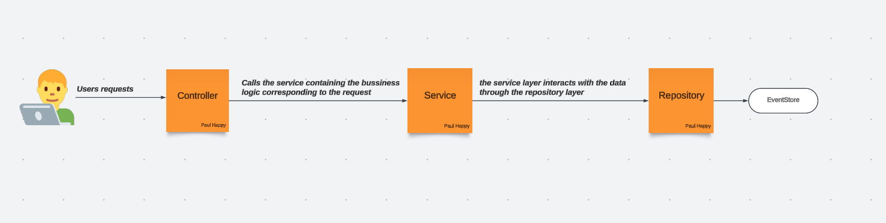
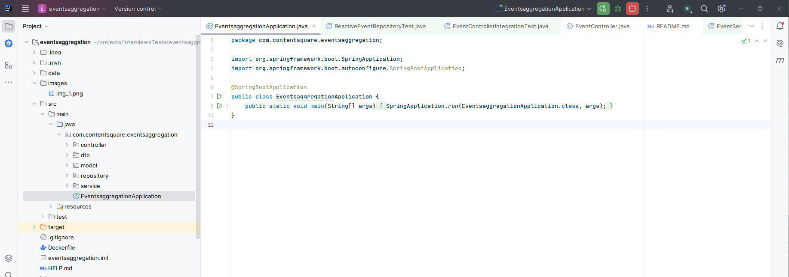

# Introduction

This project contains my results for data processing of web navigation events identified by the `user_id`, the `timestamp` (`yyyy-MM-dd'T'HH:mm:ss` format)
of the event and the `event` type (click, hover, swipe, mouseDown... there can be a maximum of 20 different event types).
It's really important for us to be able to store and query this data in the most efficient way, that's why we are going
to ask you to design a simple data store that'll be used to do some aggregations on the data.


# Problem definition

We are going to provide you a well-formatted tsv file with some data, having the following columns: user_id, timestamp, event.

There is only 1 event per combination of `user_id, timestamp, event` in the system, due to the nature of the pipeline producing events, you might receive the same event multiple times).
All indicated timestamps must be inclusive.


## Requirements
This project is programmed in **Java 21**, which you will need to have in order to run the project, [the link install java 21](https://bluevps.com/blog/how-to-install-java-on-ubuntu)

You will also need **Maven**, which is used to build and manage the project.

To simplify the execution and testing of the application on various environments, I have conteunerised the application and created an image that has been pushed to Docker Hub, so it will be possible to download this image and run it.

**Sample of data put in folder **
## Solution
Having events with the following fields: user_id, timestamp, event. We need to make sure there is only 1 event per combination of `user_id, timestamp, event` in our system
(due to the nature of the pipeline producing events, you might receive the same event multiple times).

We need to create datastore which will be able to ingest the generated data and provide an API for doing aggregations.

For this test, we create 3 endpoints:
- `GET : /count?date_from=''&date_to=''&event=''&user_id=''`
- `GET : /count_distinct_users?date_from=''&date_to=''&event=''`
- `GET : /exists?&event=''&user_id=''`

For this problem I opted for a solution that can manage requests in parallel. I opted for reactive programming, because it's an assynchronous programming paradigm, which is intended to be non-blocking and easy to integrate with Rest APIs using frameworks.
I used the java spring webflux framework, which will make it easier to create reactive applications.


### Structure
Layer java application that retrieve data from file inside

- **Model package:** Contains all the data model classes like Event. This keeps your domain objects clean and separate from the business logic and other concerns.

- **Repository package:** Contains the ReactiveEventRepository, which handles data storage and retrieval operations. This separation ensures that data access logic is isolated and can be replaced or scaled independently of business logic.

- **Service package:** Contains the business logic. EventService handles the application logic, while EventLoaderService is responsible for loading the TSV file data. This separation of concerns makes the application more modular and easier to test.

- **Controller package:** Contains the EventController, which handles HTTP requests and interacts with the service layer to return responses. This keeps the controller thin, focusing only on handling HTTP requests.



### Technical information
It uses the following specs:
- Uses the **spring webflux** framework
- AssertJ + Junit 5 + Mockito to test and get better assertions

## Run information
To run the application, you can use IDE that will be able to run the java programs, built with Maven or build the jar and run with command land or use Docker image yald/mower-task:1.0.0.

- Use the IDE




- To date it is possible to create an uber jar with maven:

    go in project folder `src/main/resources/data` and add the data file in **.tsv** format

    ` cd eventsaggregation `

    ```$ mvn package -f pom.xml```

    ```$ java -jar --enable-preview target/eventsaggregation-0.0.1-SNAPSHOT.jar```


- Use Docker image: stay in root folder

  ```$ docker run -p 8080:8080  -v /pathToDataFile/data:/Users/pauhappy/data  yald/eventsaggregation:0.0.1 ```


    NB: you will need to be connected to docker hub registry before you can launch the image, as you will need to download the image from docker hub.
    $ docker login

    You can also build the local docker image and run it with the following command  (eventsaggregation project folder) :
    $ mvn package -f pom.xml
    $ docker build -teventsaggregation:0.0.1 .
    $ docker run -p 8080:8080  -v /Users/pauhappy/data:/Users/pauhappy/data  eventsaggregation:0.0.1

    For the data to be taken into account when the application is launched, the folder containing the data must be mounted, as shown in the example below
    Example:  docker run -p 8080:8080  -v /Users/pauhappy/data:/data  yald/eventsaggregation:0.0.1

## Additional questions
- With a larger volume of data, We need to ensure that have a database capable of handling the volume of data. As the format of the application isn't transactonal, I'd opt for a NoSQL database that would allow horizontal scaling, including parallel partioning and execution. 
  
  In our case, given that we're doing reactive programming, the requests are managed asynchronously, so there's already parallel execution in place. We'll need to be careful about back pressure.


- There are several optimizations that could have been implemented but weren’t due to time constraints:

  - Data Indexing:
    Implementing efficient indexing strategies on the data to speed up searches and retrieval operations, especially for large datasets.

  - Asynchronous Processing and Backpressure Handling:
    Advanced management of backpressure and flow control in reactive streams to prevent the system from becoming overwhelmed by fast-producing sources, especially in a scenario where the data is large or arriving continuously.

  - Caching Mechanisms:
    Introducing caching for frequently accessed data or results of expensive operations to reduce the need for repeated computations.
    

- Handling a continuous stream of data while supporting aggregation queries is a common scenario in real-time analytics and stream processing. Here’s how we could manage this:

  - Streaming Platforms (e.g., Apache Kafka + Kafka Streams, Apache Flink):
  Use a streaming platform like Apache Kafka combined with Kafka Streams or Apache Flink. These tools allow to ingest, process, and aggregate data in real-time as it arrives. They support windowing and event time processing, which are essential for performing aggregations over streams.

  - Windowing:
  Implement windowing techniques to aggregate data over specific time intervals. For example, we might want to calculate the average event count per minute or per hour.

  - Stateful Stream Processing:
  Maintain stateful transformations in stream processing pipeline. For example, using stateful operators to keep track of counts, sums, or other metrics that are required for your aggregations. The state can be stored in memory or persisted to a durable store like Apache Kafka's internal state store, RocksDB, or even an external database.

  - Materialized Views:
  Use materialized views to store the results of aggregation queries that are continuously updated as new data flows in. This allows to respond to queries in real-time without reprocessing the entire data stream.


